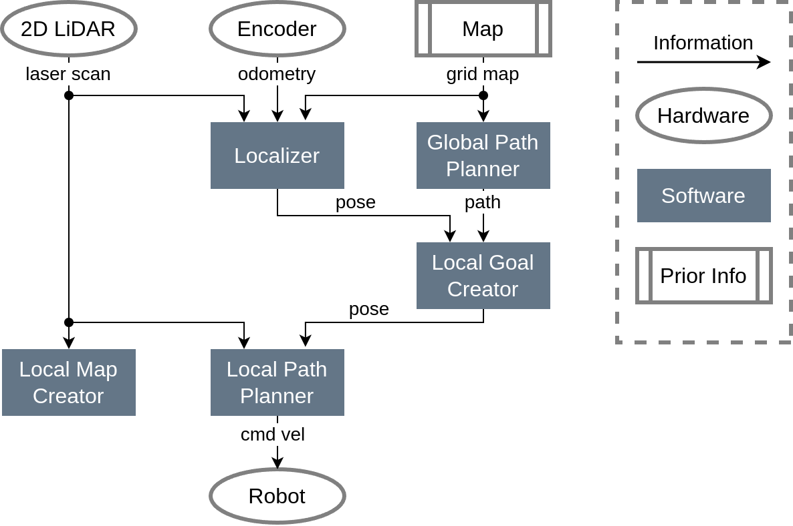

# amr_navigation_ros

[](https://opensource.org/licenses/MIT)

A 2D navigation metapackage for AMR (Autonomous Mobile Robot)

## Environment
- Ubuntu 20.04
- ROS Noetic

## System
<p align="center">
  
</p>

## packages
| Package | Build Status |
| ------ | ------|
| [a_star_ros](https://github.com/ToshikiNakamura0412/a_star_ros.git) |  |
| [dwa_planner](https://github.com/amslabtech/dwa_planner.git) |  |
| [emcl_ros](https://github.com/ToshikiNakamura0412/emcl_ros.git) |  |
| [local_goal_creator_ros](https://github.com/ToshikiNakamura0412/local_goal_creator_ros.git) |  |
| [raycast_mapping_ros](https://github.com/ToshikiNakamura0412/raycast_mapping_ros.git) |  |
| [scan_to_pcl_ros](https://github.com/ToshikiNakamura0412/scan_to_pcl_ros.git) |  |

## Install and Build
```
# clone repository
cd /path/to/your/catkin_ws/src
git clone https://github.com/ToshikiNakamura0412/amr_navigation_ros.git
cd amr_navigation_ros
vcs import navigation < .rosinstall

# build
cd /path/to/your/catkin_ws
rosdep install --from-paths src --ignore-src -y # Install dependencies
catkin build -DCMAKE_BUILD_TYPE=Release         # Release build is recommended
```

## Running the demo
### Using simulator
```
# clone repository
cd /path/to/your/catkin_ws/src
git clone -b noetic-devel https://github.com/ROBOTIS-GIT/turtlebot3_msgs.git
git clone -b noetic-devel https://github.com/ROBOTIS-GIT/turtlebot3.git
git clone -b noetic-devel https://github.com/ROBOTIS-GIT/turtlebot3_simulations.git

# build
cd /path/to/your/catkin_ws
rosdep install --from-paths src --ignore-src -y # Install dependencies
catkin build -DCMAKE_BUILD_TYPE=Release         # Release build is recommended

# run demo
export TURTLEBOT3_MODEL=burger
roslaunch amr_navigation_ros test.launch
```
